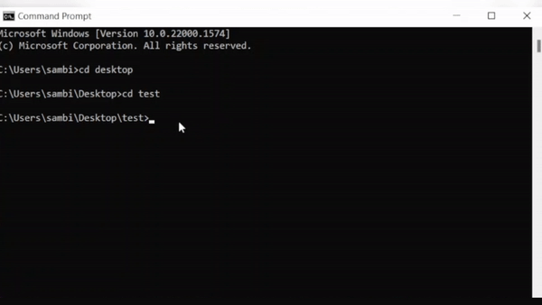

<p align="center">
    </img>
</p>

<h1 align="center">create-zksync-app</h1>

<div align="center">
    
    
    
    
</div><br>

A full-stack starter template with React & Hardhat to develop, deploy, and test Solidity smart contracts on the zk sync era network. The starter kit also includes pre-installed `zk sync hardhat full code`, `tailwindcss`, `web3.js`, etc. packages.


## 📺 Quickstart

<div align="center">
</div>

## 🛠️ Installation guide



### Install the Package globally
Install this for first time by running the following command in your terminal:

```sh
npm install -g create-zksync-app
```

### ⌛️ create-zksync-app command

Open up your terminal (or command prompt) and type the following command:

```sh
npx create-zksync-app <your-dapp-name>

# cd into the directory
cd <your-dapp-name>
```

### 🔑 Private key

Ensure you create a `.env` file in the `root` directory. Then paste your [Metamask private key](https://metamask.zendesk.com/hc/en-us/articles/360015289632-How-to-export-an-account-s-private-key) in `.env` with the variable name `PRIVATE_KEY` as follows:

```sh
PRIVATE_KEY=1234
```

### ⚙️ Compile

Now, you can write your contracts in `./contracts/` directory, replace `Greeter.sol` with `<your-contracts>.sol` file. To write tests, go to `./test` directory and create `<your-contracts>.test.js`.

```sh
npx hardhat compile

# for testing the smart contracts
npx hardhat test
```

After successful compilation, the artifacts directory will be created in `./src/artifacts` with a JSON `/contracts/<your-contracts>.sol/<your-contracts>.json` containing ABI and Bytecode of your compiled smart contracts.

Please make the changes while [Importing](https://github.com/sambitsargam/create-zksync-app/blob/main/src/App.js#L8) the JSON in `./src/app.js`.


### ⛓️ Deploy

Before deploying the smart contracts, please make sure you have a `zksync testnet` in your Metamask wallet with sufficient funds, follow this [quickstart](https://era.zksync.io/docs/) guide if you do not have one.

Also, make changes in `./scripts/deploy.js` (replace the greeter contract name with `<your-contract-name>`).

For deploying the smart contracts to zksync network, type the following command:

```sh
npx hardhat deploy-zksync --script  deploy.ts
```
### ⏭️ to Verify the contract 
```sh
npx hardhat verify <your-contract-address>
```

Copy-paste the deployed contract address [here](https://github.com/sambitsargam/create-zksync-app/blob/main/src/App.js#L31)

```sh
<your-contract> deployed to: 0x...
```

### 💻 React client

start react app

```sh
npm start
# Starting the development server...
```


## ⚖️ License

create-zksync-app is licensed under the [MIT License](https://github.com/sambitsargam/create-zksync-app/blob/main/LICENSE).

<hr>
Don't forget to leave a star ⭐️ ~ <a href="https://twitter.com/sambitsargam" target="_blank"></a>
